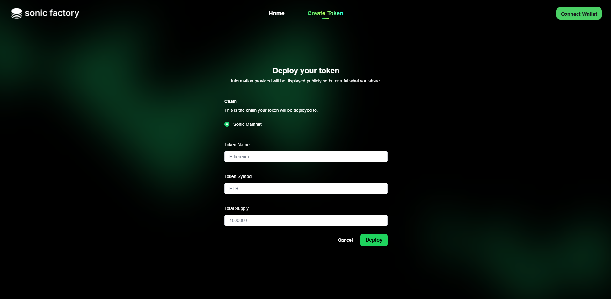

# Creating Your ERC-20 Token

### Effortless Token Deploying

<figure><figcaption>
Sonic Factory Interface
</figcaption></figure>

Creating your token is quick and straightforward. Simply click **Create Token** on the navigation bar, enter the necessary token details, and hit **Deploy**. With just a few steps, your token is ready to go, making the process efficient and hassle-free. No complex coding or setup—just a smooth, user-friendly experience!

| Token Details | Input Type | Example  |
| ------------- | ---------- | -------- |
| Token Name    | String     | Ethereum |
| Token Symbol  | String     | ETH      |
| Token Supply  | Number     | 1000000  |


You may check out [Sonic Scan](https://sonicscan.org/) or your wallet for the contract address.

